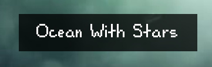
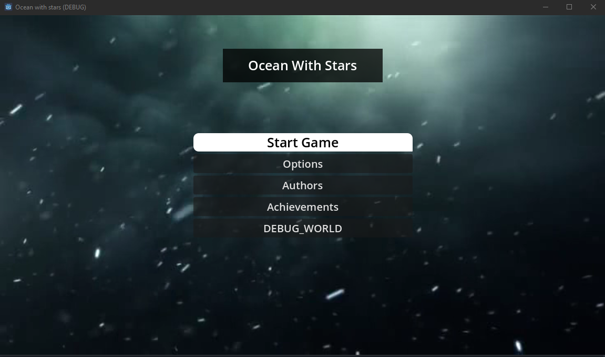

<!-- PROJECT LOGO -->
<a id="readme-top"></a>
<br />
<div align="center">
  <a href="https://github.com/othneildrew/Best-README-Template">
    
  </a>

  <h3 align="center">2D пиксельная Игра</h3>

  <p align="center">
    2D Игровой проект для Android, IOS, Windows
    <br />
    <a href="https://github.com/BitBoxxxer/ocean-with-stars"><strong>Изучите документацию »</strong></a>
    <br />
    <br />
    &middot;
    <a href="#readme-author">Связаться с автором</a>
    &middot;
  </p>
</div>

<!-- <p align="right">(<a href="#readme-author">назад к началу</a>)</p> -->


<!-- TABLE OF CONTENTS -->
<details>
  <summary>Содержание</summary>
  <ol>
    <li>
      <a href="#about-the-project">О проекте</a>
    </li>
    <li>
      <a href="#getting-started">Установка</a>
    </li>
    <li><a href="#roadmap">План развития</a></li>
    <li><a href="#license">Лицензия</a></li>
    <li><a href="#contact">Контакты автора</a></li>
  </ol>
</details>

<a id="about-the-project"></a>

<!-- ABOUT THE PROJECT -->
## О проекте

***Скриншот продукта (DEBUG Vers.)***\


#### Существа живущие в бесконечном космосе, неизвестно откуда они прибыли точно, может исследования этих организмов помогут понять загадку этой новой, необузданной галактики и помочь вернуться вам домой, если это все еще возможно.

>Мой 2d мобильный игровой проект на Godot\
Тема-Жанр: Фантастика, Инди, Сюжетное.
```
Игроку потребуется путешествовать в различных точках космоса, выходя из своего шаттла и плавая в далинах космоса, словно в океане.
Время от времени игрок будет возвращаться в свою базу для определения следующей точки маршрута. (для которой нужно будет улучшать свой шаттл, за местную валюту, полученную с продаж туш космической фауны.)
Так же игрок сможет полноценно улучшать свое снаряжение, баллоны, оружие, скафандр и его прочность.
```

<p align="right">(<a href="#readme-top">назад к началу</a>)</p>

<a id="getting-started"></a>

## Начало работы

```
Чтобы получить локальную копию и запустить игру, следуйте этим простым шагам.
```

### 1 Установка на телефон:

Android:

()

>*Установить APK пакет из репозитория: ссылка (сделать позже выделенный репозиторий для APK OWS)*

IOS:

()

### 2 Установка на ПК:

>*Установить приложение из репозитория: ссылка (сделать позже выделенный репозиторий для EXE OWS)*

<a id="roadmap"></a>

<!-- ROADMAP -->
## План развития

### Рассписан на доске проекта [TO-DO Листа](https://github.com/users/BitBoxxxer/projects/1)
<p align="right">(<a href="#readme-top">назад к началу</a>)</p>

<a id="license"></a>

<!-- LICENSE-->
## Лицензия

### Распространяется по лицензиям. См. [`LICENSE.txt`](https://github.com/BitBoxxxer/ocean-with-stars/blob/master/LICENSE.txt) для получения дополнительной информации.
>Дается полное право создавать модификации, изменения, моды, при условии, что ВЫ не используете свои модификации в коммерческих целях. Не нарушаются чужие авторские права.
<p align="right">(<a href="#readme-top">назад к началу</a>)</p>
<a id="readme-author"></a>

<a id="contact"></a>

<!-- CONTACT -->
## Контакты автора

### Дискорд: [Kasey](https://discord.com/users/653279939511975936)
### Github: [BitBoxxxer](https://github.com/BitBoxxxer)
### Почта: koitvi4@gmail.com
<p align="right">(<a href="#readme-top">назад к началу</a>)</p>